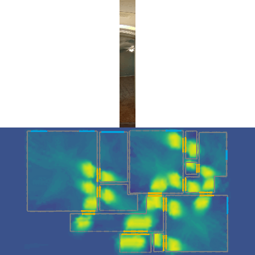
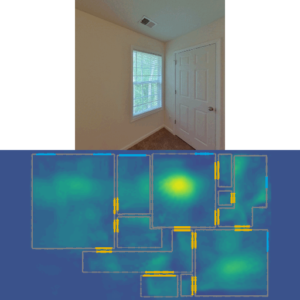

# LASER: LAtent SpacE Rendering for 2D Visual Localization
> Author: [Zhixiang Min](https://htkseason.github.io/) (Work done during an internship at Zillow Group)
>
> Contacts: zmin1@stevens.edu, najik@zillowgroup.com

This repo contains code for our **CVPR 2022 Oral** paper [LASER: LAtent SpacE Rendering for 2D Visual Localization](https://arxiv.org/abs/2204.00157). LASER introduces the concept of latent space rendering, where 2D pose hypotheses on the floor map are directly rendered into a geometrically-structured latent space by aggregating viewing ray features. Through a tightly coupled rendering codebook scheme, the viewing ray features are dynamically determined at rendering-time based on their geometries (i.e. length, incident-angle), endowing our representation with view-dependent fine-grain variability. Our codebook scheme effectively disentangles feature encoding from rendering, allowing the latent space rendering to run at speeds above **10KHz**. LASER is an accurate single-image 2D Monte-Carlo localization model that supports images of arbitrary FoVs. Our method achieves **97%** recall with a median error of **5cm 0.47deg** with single 360° panorama query on [ZInD](https://github.com/zillow/zind) dataset, while it only takes **1 sec** to sample a house-scale map at a fine resolution.

<p align="center">
  
  
  
</p>


## Related Publication
> **LASER: LAtent SpacE Rendering for 2D Visual Localization**
> Z. Min, N. Khosravan, Z. Bessinger, M. Narayana, S.B. Kang, E. Dunn, and I. Boyadzhiev
> CVPR 2022 (Oral) [[paper]](https://arxiv.org/abs/2204.00157)

```bibtex
@misc{https://doi.org/10.48550/arxiv.2204.00157,
  doi = {10.48550/ARXIV.2204.00157},
  url = {https://arxiv.org/abs/2204.00157},
  author = {Min, Zhixiang and Khosravan, Naji and Bessinger, Zachary and Narayana, Manjunath and Kang, Sing Bing and Dunn, Enrique and Boyadzhiev, Ivaylo},
  keywords = {Computer Vision and Pattern Recognition (cs.CV), FOS: Computer and information sciences, FOS: Computer and information sciences},
  title = {LASER: LAtent SpacE Rendering for 2D Visual Localization},
  publisher = {arXiv},
  year = {2022},
  copyright = {Creative Commons Attribution 4.0 International}
}
```

## Requirements
- [PyTorch 1.7.1](https://pytorch.org/get-started/previous-versions/#v171)
- (Other small requirements see `requirements.txt`, or install using `pip install -r requirements.txt`)

## Training
- Train with panorama
```
python train.py --gpu 0 --log_dir [.] --its 300000 --dataset zind --dataset_path [.]
```
- Train with 90 fov perspective images
```
python train.py --gpu 0 --log_dir [.] --fov 90 --its 300000 --dataset zind --dataset_path [.]
```
- Train with mixed (45-135) fov perspective images
```
python train.py --gpu 0 --log_dir [.] --fov2 45,135 --its 900000 --dataset zind --dataset_path [.]
```

## Inference
```
python eval.py --save --log_dir [.] --dataset zind --dataset_path [.]
```
- If model is trained with mixed FoV, need specify a fov `--fov [.]` for testing
- Remove `--save` to visualize the results on fly
- To use the pre-trained models, simply download [models.zip](https://files.zillowstatic.com/research/public/StaticFiles/laser/models.zip), extract the zip and copy the desired model to the the desired log_dir, and point the script to it similar to the example above.

## View Results on HTML
```
python scripts/generate_html.py --result_dir [.]
```
- `result_dir` is the folder created by `eval.py`.

## Quantitative Analysis
- Analyze raw data
```
python scripts/analyze_data.py --log_dir [.]
```
- Plot data table
```
python scripts/plot_data.py --log_dir [.]
```

## License
This work is released under Creative Commons Attribution-NonCommercial-NoDerivatives 4.0 International Public License (see LICENSE file for more details).


